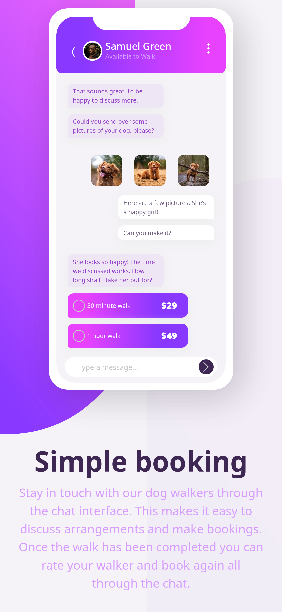
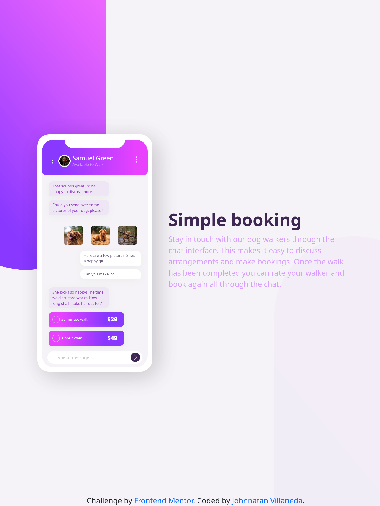
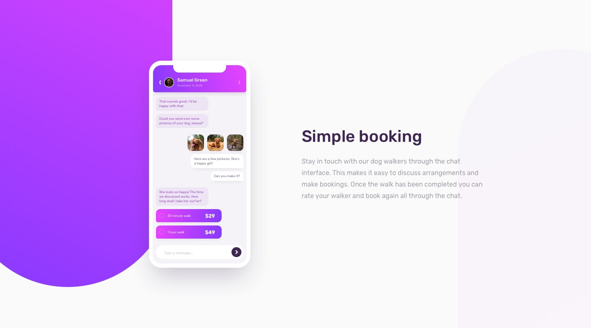

# Frontend Mentor - Chat app CSS illustration solution

This is a solution to the [Chat app CSS illustration challenge on Frontend Mentor](https://www.frontendmentor.io/challenges/chat-app-css-illustration-O5auMkFqY). Frontend Mentor challenges help you improve your coding skills by building realistic projects.

## Table of contents

- [Overview](#overview)
  - [The challenge](#the-challenge)
  - [Screenshot](#screenshot)
  - [Links](#links)
- [My process](#my-process)
  - [Built with](#built-with)
- [Author](#author)

## Overview

### Screenshot

### Links

- Solution URL: [Github Repo](https://github.com/JohnnatanV/chat-app-page)
- Live Site URL: [Vercel page livesite](https://chat-app-page-bootstrap-and-sass-project.vercel.app/)

## My process

### Built with

- Semantic HTML5 markup
- Bootstrap modeling
- Sass

## Author

- Website - [Johnnatan Villaneda](https://github.com/JohnnatanV)
- Frontend Mentor - [@JohnnatanV](https://www.frontendmentor.io/profile/JohnnatanV)
- Twitter - [@JohnnatanV](https://twitter.com/JohnnatanV)
